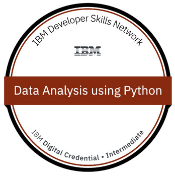

# Data Science With Python
Resource about learning Data Science With Python Offered By IBM - Platform cognitiveclass.ai
## Course: Data Analysis with Python
### Módulo 1: Importación de conjuntos de datos
- Objetivos de aprendizaje
- Entendiendo el dominio
- Comprender el conjunto de datos
- Paquete Python para ciencia de datos
- Importar y exportar datos en Python
- Información básica de conjuntos de datos

### Módulo 2: Limpieza y preparación de los datos
- Identificar y manejar valores faltantes
- Formato de datos
- Conjuntos de normalización de datos
- Binning
- Variables indicadoras
### Módulo 3: Resumen del marco de datos
- Estadísticas descriptivas
- Básico de agrupación
- ANOVA
- Correlación
- Más sobre correlación
### Módulo 4 - Desarrollo de modelos
- Regresión lineal simple y múltiple
- Evaluación de modelos mediante visualización
- Regresión polinómica y canalizaciones
- R cuadrado y MSE para evaluación en muestra
- Predicción y toma de decisiones
### Módulo 5 - Evaluación del modelo
- Evaluación del modelo
- Sobreajuste, subajuste y selección de modelo
- Regresión de cresta
- Búsqueda de cuadrícula
- Refinamiento del modelo
### Course Certificate: Data Analysis with Python**
 **[Validated Certificate of Data Analysis with Python on Credly](https://www.credly.com/badges/719a1d30-977e-40e6-a4bb-dedbe642d5a5)**
 
