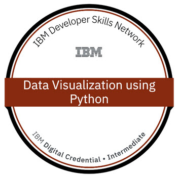

# Data Science With Python
Resource about learning Data Science With Python Offered By IBM - Platform cognitiveclass.ai
## Course: Data Visualization with Python
### Módulo 1: Introducción a las herramientas de visualización
- Introducción a la visualización de datos
- Introducción a Matplotlib
- Trazado básico con Matplotlib
- Conjunto de datos sobre inmigración a Canadá
- Gráficos de líneas
### Módulo 2: Herramientas básicas de visualización
- Area Plots
- Histogramas
- Gráfica de barras
### Módulo 3 - Herramientas de visualización especializadas
- Gráficos circulares
- Diagramas de caja
- Gráfico de dispersión
- Gráficos de burbujas
### Módulo 4: Herramientas de visualización avanzadas
- Waffle Charts
- Word Clouds
- Gráficos de regresión y de Seaborn
### Módulo 5: Creación de mapas y visualización de datos geoespaciales
- Introducción a Folium
- Mapas con Markers
- Mapas de Choropleth
### Course Certificate: Data Visualization with Python
**[Validated Certificate of Data Visualization with Python on Credly](https://www.credly.com/badges/8fffda63-7886-41fa-946c-49f4f7ea5955)**
 
