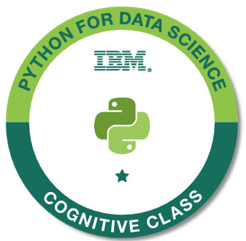

# Data Science With Python
Resource about learning Data Science With Python Offered By IBM - Platform cognitiveclass.ai
## Course: Python for Data Science:
### Módulo 1: Conceptos básicos de Python
- Tu primer programa
- Tipos de datos
- Expresiones y variables
- Operaciones de cadena
### Módulo 2: Estructuras de datos de Python
- Listas y tuplas
- Conjuntos
- Diccionarios
### Módulo 3: Fundamentos de programación Python
- Condiciones y ramificación
- Bucles
- Funciones
- Objetos y clases
### Módulo 4: Trabajar con datos en Python
- Leer archivos con open
- Escribir archivos con open
- Cargando datos con Pandas
- Trabajar y guardar datos con Pandas
### Módulo 5: Trabajar con Numpy Arrays y API simples
- Numerosas matrices 1D
- Numerosas matrices 2D
- API simples
- Configuración de API
### Course Certificate: Python for Data Science
**[Validated Certificate of Python for Data Science on Credly](https://www.credly.com/badges/20e47003-2d03-4282-a056-41f54bf8dd17)**
 
